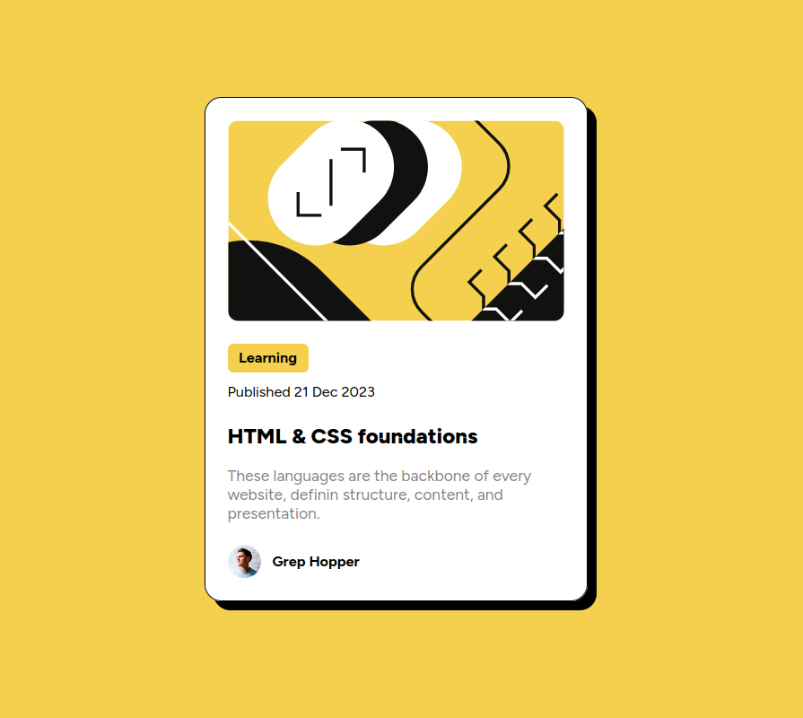

# Frontend Mentor - Blog preview card component solution

This is a solution to the [Blog preview card challenge on Frontend Mentor](https://www.frontendmentor.io/challenges/blog-preview-card-ckPaj01IcS).

[Live Demo](https://hokay-blog-preview-component.vercel.app/)

## Screenshots

### Desktop

## Built with

- Semantic HTML5 markup
- Flexbox
- CSS

## Author

- Portfolio - [hakanokay.dev](https://hakanokay.dev/)
- Frontend Mentor - [@h-okay](https://www.frontendmentor.io/profile/h-okay)
